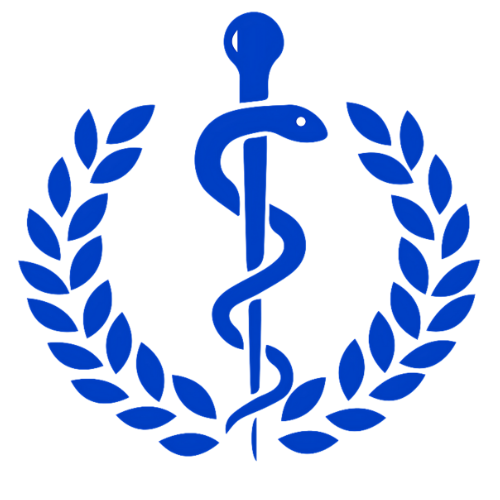
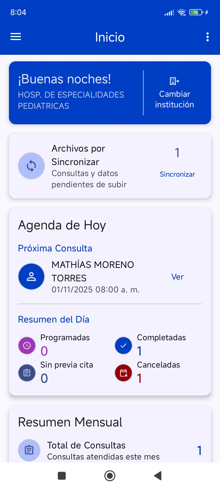

# NutriZulia - Android

<p align="center">
  
</p>

<p align="center">
  
  
  
  
  
  
  
  
  
  
</p>

<a id="tabla-de-contenidos"></a>
## Tabla de Contenidos

- [Introducción](#introduccion)
- [Características Principales](#caracteristicas-principales)
- [Arquitectura del Proyecto](#arquitectura-del-proyecto)
- [Tecnologías Utilizadas](#tecnologias-utilizadas)
- [Requisitos del Sistema](#requisitos-del-sistema)
- [Instalación](#instalacion)
- [Uso de la Aplicación](#uso-de-la-aplicacion)
  - [Inicio de Sesión](#inicio-de-sesion)
  - [Selección de institución y perfiles](#seleccion-de-institucion)
  - [Gestión de Pacientes](#gestion-de-pacientes)
  - [Gestión de Representantes](#gestion-de-representantes)
  - [Programación y registro de consultas](#programacion-de-consultas)
  - [Evaluación clínica y registros](#evaluacion-clinica)
  - [Sincronización por lotes (Batch) de colecciones](#sincronizacion-batch)
  - [Sincronización completa (Full) de colecciones](#sincronizacion-full)
  - [Catálogos y ubicación geográfica](#catalogos-ubicacion)
  - [Notificaciones y recordatorios de citas](#notificaciones)
  - [Seguridad y manejo de tokens](#seguridad-tokens)
  - [Configuración de red y manejo de errores](#config-red)
- [Capturas de Pantalla](#capturas-de-pantalla)
- [Base de Datos](#base-de-datos)
- [Seguridad](#seguridad)

<a id="introduccion"></a>
## Introducción

**NutriZulia** es una aplicación móvil Android desarrollada para la **Coordinación Regional de Nutrición y Dietética**. Facilita la gestión integral de pacientes y consultas nutricionales, permitiendo a profesionales de la salud realizar seguimiento del estado nutricional con flujos de trabajo seguros y estructurados.
Este proyecto forma parte del ecosistema NutriZulia junto con los repositorios correspondientes al frontend web (Angular) y al backend (Spring Boot) del sistema.

Referencias públicas:
- Backend (Spring Boot): [andresmtataseo/NutriZulia-Backend](https://github.com/andresmtataseo/NutriZulia-Backend)
- Frontend web (Angular): [andresmtataseo/NutriZulia](https://github.com/andresmtataseo/NutriZulia)

<a id="caracteristicas-principales"></a>
## Características Principales

### Autenticación y Gestión de Usuarios
- Sistema de login seguro con cédula y contraseña
- Gestión de perfiles institucionales y selección de institución activa
- Cierre de sesión y salida segura

### Gestión de Pacientes
- Registro completo de pacientes y vínculo con representantes
- Búsqueda y filtrado por nombre o cédula
- Historia clínica con datos antropométricos y metabólicos
- Información demográfica y datos de contacto

### Gestión de Consultas
- Programación de citas por especialidad
- Registro de consultas con motivo y observaciones
- Estados de consulta (programada, realizada, cancelada)

### Evaluación Nutricional
- Mediciones antropométricas y metabólicas
- Signos vitales y diagnósticos
- Reglas de interpretación (IMC, percentil, Z-Score)

### Reportes y Seguimiento
- Historial de consultas por paciente
- Reportes de actividades e indicadores
- Seguimiento temporal de indicadores

<a id="arquitectura-del-proyecto"></a>
## Arquitectura del Proyecto

El proyecto sigue una **arquitectura limpia (Clean Architecture)** con separación clara de responsabilidades:

```
app/src/main/java/com/nutrizulia/
├── data/                    # Capa de datos
│   ├── local/              # Base de datos local (Room)
│   │   ├── entity/         # Entidades de base de datos
│   │   ├── dao/            # Data Access Objects
│   │   └── converter/      # Convertidores para Room
│   ├── remote/             # API remota
│   │   ├── api/            # Servicios de API
│   │   └── dto/            # Data Transfer Objects
│   └── repository/         # Repositorios
├── domain/                 # Capa de dominio
│   ├── model/              # Modelos de dominio
│   ├── usecase/            # Casos de uso
│   └── exception/          # Excepciones de dominio
├── presentation/           # Capa de presentación
│   ├── view/              # Activities y Fragments
│   ├── viewmodel/         # ViewModels
│   └── adapter/           # Adaptadores para RecyclerViews
├── di/                    # Inyección de dependencias (Hilt)
└── util/                  # Utilidades y helpers
```

<a id="tecnologias-utilizadas"></a>
## Tecnologías Utilizadas

### Core Android
- Kotlin, Android SDK (Target SDK 35)
- ViewBinding, Navigation Component

### Arquitectura y Patrones
- MVVM, Clean Architecture, Repository Pattern, Use Case Pattern

### Base de Datos
- Room (SQLite), Type Converters

### Networking
- Retrofit, OkHttp, Gson

### Inyección de Dependencias
- Hilt, KSP

### UI/UX
- Material Design, SwipeRefreshLayout, Lottie, Speed Dial

### Seguridad
- Security Crypto, DataStore, JWT

<a id="requisitos-del-sistema"></a>
## Requisitos del Sistema

- Android API Level: 26+
- Target SDK: 35
- Java Version: 11
- Kotlin Version: 2.0.21
- Android Studio Arctic Fox o superior
- Gradle 8.10.1

<a id="instalacion"></a>
## Instalación

1. Clonar el repositorio:
   - `git clone <url-del-repositorio>`
2. Abrir el proyecto en Android Studio.
3. Sincronizar dependencias con Gradle.
4. Configurar el JDK (11) y el SDK (Target 35).

<a id="uso-de-la-aplicacion"></a>
## Uso de la Aplicación

<a id="inicio-de-sesion"></a>
### 1. Inicio de Sesión
- Ingresar cédula y contraseña
- Seleccionar institución de trabajo
- Acceder al dashboard principal

```kotlin
// LoginViewModel.kt
@HiltViewModel
class LoginViewModel @Inject constructor(
    private val signInUseCase: SignInUseCase
) : ViewModel() {
    fun logearUsuario(cedula: String, clave: String) {
        viewModelScope.launch {
            val result = signInUseCase(cedula.trim().uppercase(), clave)
            if (result.isSuccess) {
                // Navegar al dashboard y cargar institución activa
            } else {
                // Mostrar error específico: 401 (credenciales) u otros
            }
        }
    }
}
```

<a id="seleccion-de-institucion"></a>
### 2. Selección de institución y perfiles
- Persistencia y lectura de `usuarioInstitucionId` para filtrar datos.
- Cambios de institución actualizan el contexto de todas las operaciones.

```kotlin
// Obtener el ID de institución antes de operaciones críticas
val institutionId = getCurrentInstitutionId() ?: throw IllegalStateException("No se ha seleccionado una institución.")
```

<a id="gestion-de-pacientes"></a>
### 3. Gestión de Pacientes
- Registro, edición y validación en tiempo real de cédula.
- Carga de catálogos (etnia, nacionalidad, estado, municipio, parroquia).
- Vínculo paciente-representante y control de errores/mensajes.

```kotlin
// RegistrarPacienteViewModel.kt (extracto)
@HiltViewModel
class RegistrarPacienteViewModel @Inject constructor(
    private val savePaciente: SavePaciente,
    private val getPacienteByCedula: GetPacienteByCedula,
    private val getEstados: GetEstados,
    private val getMunicipios: GetMunicipios,
    private val getParroquias: GetParroquias,
    private val getCurrentInstitutionId: GetCurrentInstitutionIdUseCase
) : ViewModel() {
    fun onCreate(pacienteId: String?, isEditable: Boolean) { /* carga paralela de datos */ }
    fun guardarPaciente(p: Paciente) {
        viewModelScope.launch {
            val instId = getCurrentInstitutionId() ?: return@launch
            p.usuarioInstitucionId = instId
            savePaciente(p)
        }
    }
}
```

<a id="gestion-de-representantes"></a>
### 4. Gestión de Representantes
- Creación/edición de representantes y asociación `PacienteRepresentante`.
- Validación de campos y límites de dependientes.
- Uso de `SavePacienteRepresentante`, `CountPacientesByRepresentante`, `GetRepresentanteById`, `GetParentescoById`.

<a id="programacion-de-consultas"></a>
### 5. Programación y registro de consultas
- Carga de paciente y catálogos (`TiposActividades`, `Especialidades`).
- Validación, guardado de consulta y cálculo de fechas saturadas.

```kotlin
// RegistrarCitaViewModel.kt (extracto)
fun guardarConsulta(consulta: Consulta) {
    viewModelScope.launch {
        val institutionId = idUsuarioInstitucion.value ?: error("Institución requerida")
        consulta.usuarioInstitucionId = institutionId
        saveConsulta(consulta)
    }
}
```

<a id="evaluacion-clinica"></a>
### 6. Evaluación clínica y registros
- Captura de detalles `Antropométricos`, `Metabólicos`, `Obstetricia`, `Pediátricos`, `Vitales`.
- Soporte de reglas de interpretación (IMC, percentil, Z-Score) y `Evaluaciones Antropométricas` derivadas.

<a id="sincronizacion-batch"></a>
### 7. Sincronización por lotes (Batch) de colecciones
- Sincroniza actividades, representantes, pacientes, relaciones y datos clínicos.
- Reporte de éxitos/fallos por tabla y conteo total.

```kotlin
@Inject lateinit var syncBatch: SyncCollectionBatch

viewModelScope.launch {
    val result = syncBatch()
    if (result.overallSuccess) {
        // Mostrar resumen: result.summary, totales y tablas con errores
    }
}
```

<a id="sincronizacion-full"></a>
### 8. Sincronización completa (Full) de colecciones
- Recupera y restaura el dataset completo por entidad.
- Mantiene orden e integridad referencial y genera resumen detallado por tabla.

```kotlin
@Inject lateinit var fullSync: FullSyncCollections

viewModelScope.launch {
    val r = fullSync { tabla, i, total -> /* actualizar progreso UI */ }
    // r.overallSuccess, r.totalRecordsRestored, r.tableResults
}
```

<a id="catalogos-ubicacion"></a>
### 9. Catálogos y ubicación geográfica
- Sincroniza catálogos independientes (`roles`, `etnias`, `enfermedades`, etc.) y de ubicación (`estados`, `municipios`, `parroquias`).
- Aplica `upsert` y controla versiones con `VersionDao`.

<a id="notificaciones"></a>
### 10. Notificaciones y recordatorios de citas
- Worker en segundo plano (`AppointmentReminderWorker`).
- Conteo de citas (12h) y detalle de cita (1h), con creación de canales.

```kotlin
// Crear canal y mostrar notificación (helper)
notificationHelper.ensureChannels()
notificationHelper.show12hCount(count = 3)
```

<a id="seguridad-tokens"></a>
### 11. Seguridad y manejo de tokens
- Manejo de tokens JWT con `TokenManager`.
- Interceptores de error (`ErrorInterceptor`) y clientes autenticados.

<a id="config-red"></a>
### 12. Configuración de red y manejo de errores
- Clientes por contexto (auth y autenticado) en `NetworkModule`.
- `Gson` para serialización, `OkHttp` para interceptores y logging.
- Mapeo de errores comunes y reintentos cuando aplica.

<a id="capturas-de-pantalla"></a>
## Capturas de Pantalla

### Inicio
- Pantalla principal con acceso rápido a funciones clave.
<p align="center">
  
</p>

### Iniciar sesión
- Formulario de acceso con cédula y contraseña.
<p align="center">
  
</p>

### Seleccionar institución
- Selección del contexto institucional y perfiles de trabajo.
<p align="center">
  
</p>

### Gestionar pacientes
- Listado y búsqueda de pacientes registrados.
<p align="center">
  
</p>

### Registrar paciente
- Formulario de alta con validaciones de cédula y datos.
<p align="center">
  
</p>

### Registrar representante
- Registro de representante y asociación con paciente.
<p align="center">
  
</p>

### Gestionar citas
- Visualización y administración de citas programadas.
<p align="center">
  
</p>

### Registrar cita
- Creación de consulta con especialidad y fecha.
<p align="center">
  
</p>

### Registrar evaluaciones en consulta
- Captura de evaluaciones antropométricas y metabólicas durante la consulta.
<p align="center">
  
</p>

### Registrar datos clínicos en consulta
- Registro de signos vitales, diagnósticos y notas.
<p align="center">
  
</p>

### Resumen médico
- Resumen consolidado del estado y registros del paciente.
<p align="center">
  
</p>

### Sincronizar datos
- Sincronización de colecciones en lote y completa.
<p align="center">
  
</p>

### Gestionar cuenta
- Opciones de perfil, seguridad y cierre de sesión.
<p align="center">
  
</p>

<a id="base-de-datos"></a>
## Base de Datos

La aplicación utiliza **Room Database** con las siguientes entidades principales:

### Entidades de Usuario
- `Usuario`, `UsuarioInstitucion`, `Institucion`, `Rol`

### Entidades de Pacientes
- `Paciente`, `Representante`, `PacienteRepresentante`

### Entidades de Consultas
- `Consulta`, `DetalleAntropometrico`, `DetalleMetabolico`, `DetalleVital`, `Diagnostico`

### Entidades de Catálogos
- `Estado`, `Municipio`, `Parroquia`, `Etnia`, `Nacionalidad`, `Enfermedad`, `Especialidad`

<a id="seguridad"></a>
## Seguridad

- Autenticación JWT con tokens seguros.
- Encriptación local de datos sensibles.
- Validación de entrada y manejo de errores seguro.